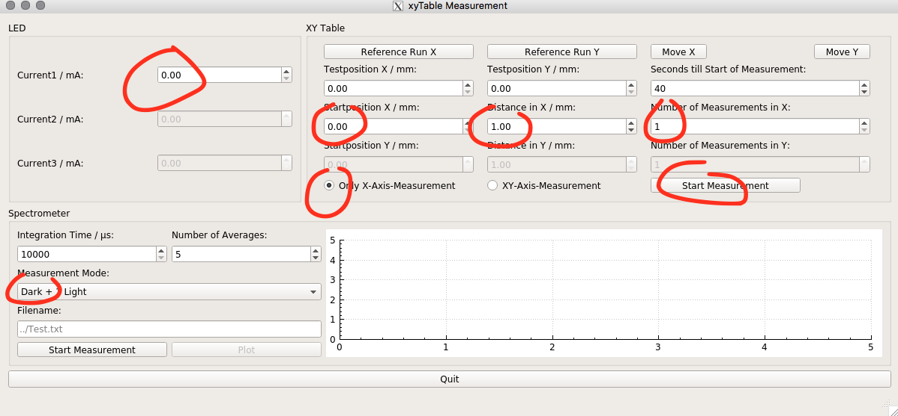
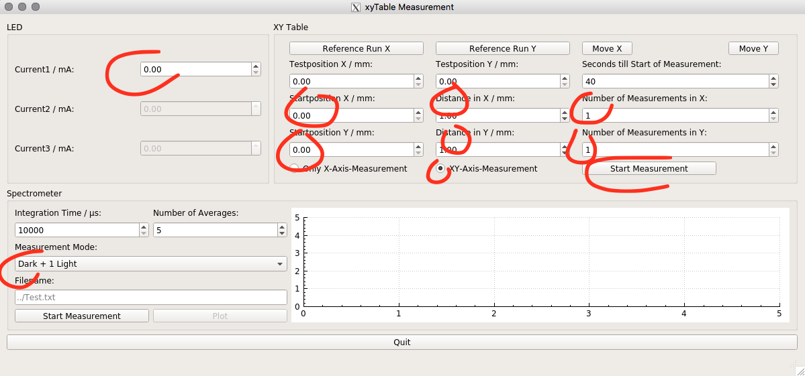

# Control of a XYTable
 Author: Janine Müller

## Description
A XY-Table is a construction built from two linear tracks, which are mounted perpendicular. To allow a movement in two directoins (x and y) the second track is mounted on the carriage of the first track. The x axis has a traveling distance of 2500mm and the y axis of 200mm.  
Both axis are driven by TRINAMIC motors and connected to the PC via RS232.  
This software allows to do measurements with this XYTable on scintillating fibres and fibre mats from scintillating fibres. For this a current source operated via RS232 allows to pilot UV-LEDs to excite the fibre(s).  
To get the response of the scintillating fibre (or mat) a spectrometer is read out via USB.  
It is possible to do measurements in x and y direction as well as only in x direction e.g. to determine attenuation lengths.  
Special mounting setups for the spectrometer allow as well a angular dependent measurement of the fibre response.

The repository contains the source code as well as CMakeLists and a GUI version to operate such system.

## Requirements to run terminal program

Availability of the following libraries (author: Janine Müller):
* [LEDClass][1]
* [SpectrometerClass][2]
* [MotorControl][3]
* [RS232Communication][4]

Driver of Hamamatsu Spectrometer:
needs to be rebuilt everytime kernel is being updated
* https://sourceforge.net/p/usbspecdrivers/wiki/Installation/
* edit `usbhspec.c` such as (2 times):

```bash
//static DEVICE_ATTR(gain, S_IWUGO | S_IRUGO, show_gain, set_gain);
static DEVICE_ATTR(gain, 0660, show_gain, set_gain);
```
* make sure, that your user is in group `plugdev`

RS232 Currentsource:
* Make sure that your user is in group `dialout`

## Requirements  to run GUI

Install QT5:
* QT5 uses different number format 
* add to your `.bashrc`:

```bash
export CMAKE_PREFIX_PATH=/usr/local/Qt-5.8.0/
export LC_NUMERIC=en_US.UTF-8
```

Get QCustomPlot:
* https://github.com/dbzhang800/QCustomPlot

## How to run the control

### Terminal progamm

1.) Compile source code:

```bash
mkdir build
cd build
cmake ..
make
```

2.) Execute it:

```bash
./bin/xyTableMain
```

3.) Follow instructions written in terminal.


### GUI

0.) Go to GUI folder

```bash
cd xyTable_gui
```

1.) Compile source code:

```bash
mkdir build
cd build
cmake ..
make
```

2.) Execute it:

```bash
./bin/xyTableGui
```

3.) A window is opening to control the xyTable.


4.) Only X axis measurement:
1. Apply a reference run if nessesary (carriages will move towards end switches to find zero position)
2. Choose `Only X-Axis-Measurement`
3.  Choose `Startposition X / mm`, `Distance in X / mm` and `Number of Measurements in X`
	* Test the X-Startposition with `Testposition X / mm` and button `Move X`
4. Choose a Spectrometer Measurement Mode:
	*  `Single` + `Start Measurement` - Just a snapshot, afterwards you can hit the `Plot` button to display spectrum (use it to find the correct current)
	* `Dark + 1 Light` - At each position take a darkcount and a light measurement with the given current
	* `Dark + 3 Light` - At each position take a darkcount and 3 light measurements with the given currents
5. If wanted: Specify path and name for the saved files in the `Spectrometer` section.
	* Name will get a `_Spectrum_x=...txt` appended
	* if not specified it will be saved at `~/data/Spectrometer/Spectrum_x=...txt`
6. Choose a current for the LED (3 currents if `Dark + 3 Light` Measurement Mode was chosen)
7. Choose a sleeping time, which you need, to leave the room and darken everything
8. Hit the `Start Measurement` button at the `XY Table`section to start actually the measurement




5.) XY axis measurement:
1. Apply a reference run if nessesary (carriages will move towards end switches to find zero position)
2. Choose `XY-Axis-Measurement`
3.  Choose `Startposition X / mm`, `Distance in X / mm` and `Number of Measurements in X`
	* Test the X-Startposition with `Testposition X / mm` and button `Move X`
4.  Choose `Startposition Y / mm`, `Distance in Y / mm` and `Number of Measurements in Y`
	* Test the Y-Startposition with `Testposition Y / mm` and button `Move Y`
5. Choose a Spectrometer Measurement Mode:
	*  `Single` + `Start Measurement` - Just a snapshot, afterwards you can hit the `Plot` button to display spectrum (use it to find the correct current)
	* `Dark + 1 Light` - At each position take a darkcount and a light measurement with the given current
	* `Dark + 3 Light` - At each position take a darkcount and 3 light measurements with the given currents
6. If wanted: Specify path and name for the saved files in the `Spectrometer` section.
	* Name will get a `_Spectrum_x=.._y=...txt` appended
	* if not specified it will be saved at `~/data/Spectrometer/Spectrum_x=.._y=...txt`
7. Choose a current for the LED (3 currents if `Dark + 3 Light` Measurement Mode was chosen)
8. Choose a sleeping time, which you need, to leave the room and darken everything
9. Hit the `Start Measurement` button at the `XY Table` section to start actually the measurement





[1]: https://git.e5.physik.tu-dortmund.de/jmueller/LEDClass
[2]: https://git.e5.physik.tu-dortmund.de/jmueller/SpectrometerClass
[3]: https://git.e5.physik.tu-dortmund.de/jmueller/MotorControl
[4]: https://git.e5.physik.tu-dortmund.de/jmueller/RS232communication